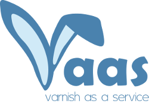

VaaS - Varnish as a Service
---------------------------

VaaS enables you to manage cluster(s) of Varnish servers from one place, via a web GUI or a REST API. Information about 
your Varnish servers and their backends, directors and probes is saved into a database. It is then used to automatically 
generate and distribute VCLs.

### Why we wrote it
We got tired of having to edit VCLs manually, storing them under version control and waiting for puppet to distribute 
them. As our SOA architecture grew, we found ourselves doing it more and more. So we wrote VaaS. Now each team can 
administer their service's backends by themselves. And they don't have to wait 30 minutes for puppet to distribute the 
change. It is applied instantly on all Varnish servers.

### Example
See [VaaS documentation](http://vaas.readthedocs.org/en/latest/) for examples how to use 
[GUI](http://vaas.readthedocs.org/en/latest/documentation/gui/), 
[API](http://vaas.readthedocs.org/en/latest/documentation/api/) and how to familiarize yourself with VaaS in 
a few simple steps using [VaaS in Vagrant](http://vaas.readthedocs.org/en/latest/quick-start/vagrant/). 

### Licensing
VaaS is an application written in Python based on Django and several other libraries. These libraries are Open Source 
and subject to their licenses. VaaS code is published under Apache Version 2.0 License.
