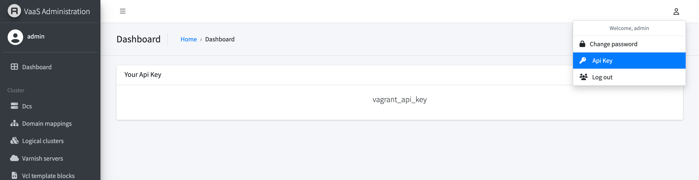

VaaS API
========

You can use VaaS API to add, edit or remove backends in directors. VaaS Rest API is based on [tastypie](https://django-tastypie.readthedocs.org/en/latest/) python library. At the moment of this writing, only json format is supported.

Resources
---------

The following resources are available:

|Name                |Description                                     |Allowed actions               |
|--------------------|------------------------------------------------|------------------------------|
|*Backend*           |Represents a single node in a service (director)|preview, **add, edit, delete**|
|*Director*          |A Varnish director; may represent a SOA service |preview, **add, edit, delete**|
|*Probe*             |A health check used to determine backend status |preview, **add, edit, delete**|
|*Dc*                |Datacentre                                      |preview, **add, edit, delete**|
|*Logical Cluster*   |Cluster of Varnish servers                      |preview, **add, edit, delete**|
|*Varnish Servers*   |A Varnish server                                |preview, **add, edit, delete**|
|*VCL Template Block*|A VCL template block                            |preview, **add, edit, delete**|
|*VCL Template*      |A VCL template                                  |preview, **add, edit, delete**|
|*Time Profile*      |Default timeouts profile for director           |preview, **add, edit, delete**|
|*Purger*            |purge object from varnishes from a given cluster|                              |

VaaS resources can be previewed under http://<VaaS instance\>/api/v0.1/?format=json

Authentication methods
----------------------

Authentication is required for all requests except schema. There is only one method of authentication: api key. Credentials for this method (i.e. username and api key) can be passed as query params or as http headers. 

To access VaaS API, first generate API key. Click on *Welcome, <username> -> Api Key* to achieve that. 

Sample API requests
===================

All examples below can be tested using [VaaS in Vagrant](../quick-start/vagrant.md).

###List directors

    curl "http://localhost:3030/api/v0.1/director/?username=admin&api_key=vagrant_api_key"

###List backends 
To list backends located in specified DC belonging to specified Director:

    curl "http://localhost:3030/api/v0.1/backend/?director__name=second_service&dc__symbol=dc1&username=admin&api_key=vagrant_api_key"

### Create a new Cluster

    curl -X POST \
    -d '{ "name": "cluster1" }' \
    -H "Content-Type: application/json" \
    "http://localhost:3030/api/v0.1/logical_cluster/?username=admin&api_key=vagrant_api_key" 

### Create a new DC

    curl -X POST \
    -d '{ "name": "dc1", "symbol": "dc1" }' \
    -H "Content-Type: application/json" \
    "http://localhost:3030/api/v0.1/dc/?username=admin&api_key=vagrant_api_key" 

### Create a new VCL template

    curl -X POST \
    -d '{ "version": "3.0", "content": "<VCL/>", "name": "vcl_template_3" }' \
    -H "Content-Type: application/json" \
    "http://localhost:3030/api/v0.1/vcl_template/?username=admin&api_key=vagrant_api_key"

### Create a new Probe

    curl -X POST \
    -d '{ "name": "probe1", "url": "/ts.1", "expected_response": "200" }' \
    -H "Content-Type: application/json" \
    "http://localhost:3030/api/v0.1/probe/?username=admin&api_key=vagrant_api_key"

### Create a new Director

    curl -X POST \
    -d '{ "name": "director1", "probe": "/api/v0.1/probe/1/", "route_expression": "/abc", "cluster": ["/api/v0.1/cluster/1/"], "mode": "round-robin", "time_profile": "/api/v0.1/time_profile/1/" }' \
    -H "Content-Type: application/json" \
    "http://localhost:3030/api/v0.1/director/?username=admin&api_key=vagrant_api_key"

### Create a new Backend and add it to a Director

    curl -X POST \
    -d '{ "address": "172.17.0.1", "director": "/api/v0.1/director/1/", "dc": "/api/v0.1/dc/1/", "inherit_time_profile": true }' \
    -H "Content-Type: application/json" \
    "http://localhost:3030/api/v0.1/backend/?username=admin&api_key=vagrant_api_key"

### Create a new Varnish server

    curl -X POST \
    -d '{ "ip": "172.17.0.7", "hostname": "varnish3", "dc": "/api/v0.1/dc/1/", "port": "6082", "secret": "edcf6c52-6f93-4d0d-82b9-cd74239146b0", "template": "/api/v0.1/template/1/", "cluster": "/api/v0.1/cluster/1/", "enabled": "True" }' \
    -H "Content-Type: application/json" \
    "http://localhost:3030/api/v0.1/varnish_server/?username=admin&api_key=vagrant_api_key"

### Delete a backend

    curl -i -X DELETE "http://localhost:3030/api/v0.1/backend/1/?username=admin&api_key=vagrant_api_key"
 
 
### Patch a list of backends

    curl -X PATCH \
    -d '{
        "objects": [
        {
          "address": "172.17.0.1",
          "between_bytes_timeout": "1",
          "connect_timeout": "0.5",
          "dc": "/api/v0.1/dc/1/",
          "director": "/api/v0.1/director/1/",
          "enabled": true,
          "first_byte_timeout": "5",
          "id": 1,
          "max_connections": 5,
          "port": 80,
          "resource_uri": "/api/v0.1/backend/1/",
          "status": "Healthy",
          "weight": 1
        },
        {
          "address": "172.17.0.2",
          "between_bytes_timeout": "1",
          "connect_timeout": "0.5",
          "dc": "/api/v0.1/dc/1/",
          "director": "/api/v0.1/director/1/",
          "enabled": true,
          "first_byte_timeout": "5",
          "id": 2,
          "max_connections": 5,
          "port": 80,
          "resource_uri": "/api/v0.1/backend/2/",
          "status": "Healthy",
          "weight": 1
        }
      ]
    }' \
    -H "Content-Type: application/json" \
    "http://localhost:3030/api/v0.1/backend/?username=admin&api_key=vagrant_api_key"

### Purge object from varnishes from a given cluster

    curl -X POST \
    -d '{ "url": "http://example.com/contact", "clusters": "cluster1_siteA_test"  }' \
    -H "Content-Type: application/json" \
    "http://localhost:3030/api/v0.1/purger/?username=admin&api_key=vagrant_api_key"
