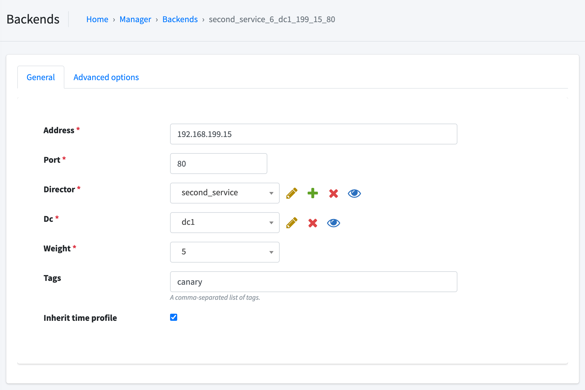

Canary deployments support
=======================

Canary deployment is a way to reduce risk of deploying new software version in production environment - by gradually
adding new software instances to production traffic.

In VaaS you can designate specified varnish server as canary varnish. If director of service will have at least
one backend with tag 'canary' then varnish server designated as canary will only has canary backends
in specified director.

At this point you can test your new version of application by adding canary varnish to production traffic. 
* For example you can add this varnish to the loadbalacer with lower ratio then other varnishes.

The second option is testing site by browsing it only through varnish tagged as canary. 
* For example you can configure your loadbalancer in such way that if http request will have the specified header, loadbalancer will has
passing traffic only to the canary varnish server.


Workflow
--------

#### Setting varnish as canary server

Go to the specified varnish server by clicking in gui:

*Cluster -> Varnish servers -> select varnish server -> select "Is canary"*

#### Setting backend as canary instance

*Manager -> Backends -> select backedns -> add "canary" (without quotes) to Tags field*




Implementation
--------------
Below is part of vcl generated by VaaS for normal varnish server (Is canary not selected).
The 'second_service_9_dc1_2_2_80' is a backend with 'canary' tag and weight 0. In this case varnish will be passing traffic to the production backends,
but not to the canary backend. If you change weight on the canary backend (second_service_9_dc1_2_2_80) varnish will be
passing traffic both, to the production backends and the canary backend.

```
backend second_service_2_dc2_2_1_80 {
    .host = "127.0.2.1";
    .port = "80";
    .max_connections = 5;
    .connect_timeout = 0.3s;
    .first_byte_timeout = 5s;
    .between_bytes_timeout = 1s;
    .probe = second_service_test_probe_1;
}

director second_service_dc2 random {
    {
      .backend = second_service_2_dc2_2_1_80;
      .weight = 1;
    }

}
backend second_service_3_dc1_2_1_80 {
    .host = "127.4.2.1";
    .port = "80";
    .max_connections = 5;
    .connect_timeout = 0.3s;
    .first_byte_timeout = 5s;
    .between_bytes_timeout = 1s;
    .probe = second_service_test_probe_1;
}
backend second_service_9_dc1_2_2_80 { # <--------------------- canary backend
    .host = "127.4.2.2";
    .port = "80";
    .max_connections = 5;
    .connect_timeout = 0.3s;
    .first_byte_timeout = 5s;
    .between_bytes_timeout = 1s;
    .probe = second_service_test_probe_1;
}

director second_service_dc1 random {
    {
      .backend = second_service_3_dc1_2_1_80;
      .weight = 1;
    }
    {
      .backend = second_service_9_dc1_2_2_80; # <--------------------- canary backend
      .weight = 0;
    }
```

Below is part of vcl generated by VaaS for canary varnish server (Is canary selected).
In this case only backend tagged as 'canary' occured in service director. The 'second_service_9_dc1_2_2_80' is
a backend with 'canary' tag and weight 0. In this case varnish will be passing traffic to the canary backend.
On the canary varnish server weight for canary backend is changed to 1, if previous was set to 0.
```
backend second_service_9_dc1_2_2_80 { # <--------------------- canary backend
    .host = "127.4.2.2";
    .port = "80";
    .max_connections = 5;
    .connect_timeout = 0.3s;
    .first_byte_timeout = 5s;
    .between_bytes_timeout = 1s;
    .probe = second_service_test_probe_1;
}

director second_service_dc1 random {
    {
      .backend = second_service_9_dc1_2_2_80; # <--------------------- canary backend
      .weight = 1; # <--------------------- wieght changed from 0 to 1
    }

}
```

