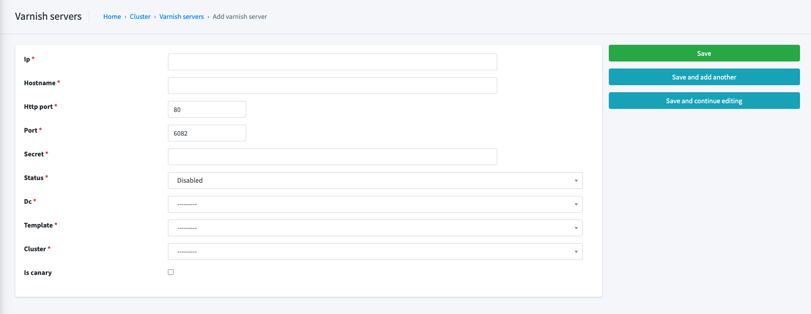
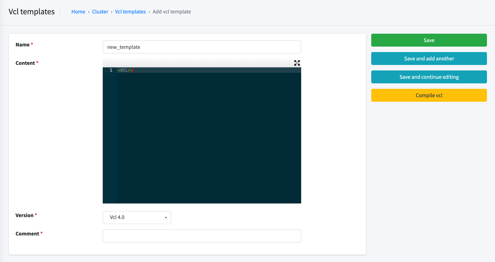
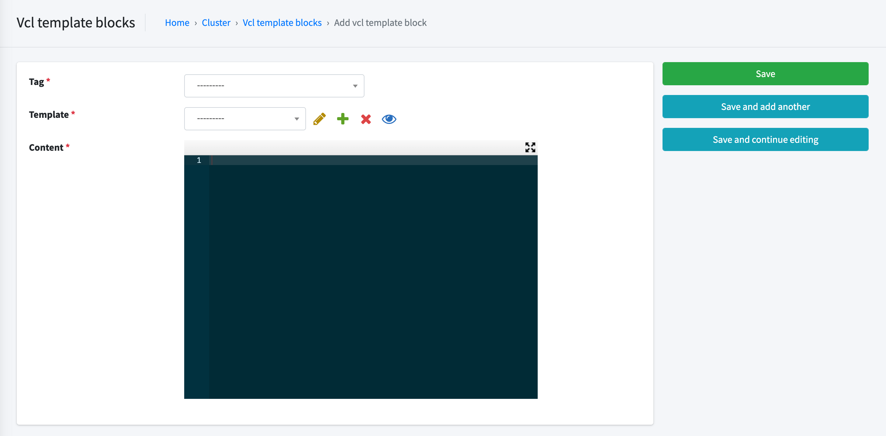
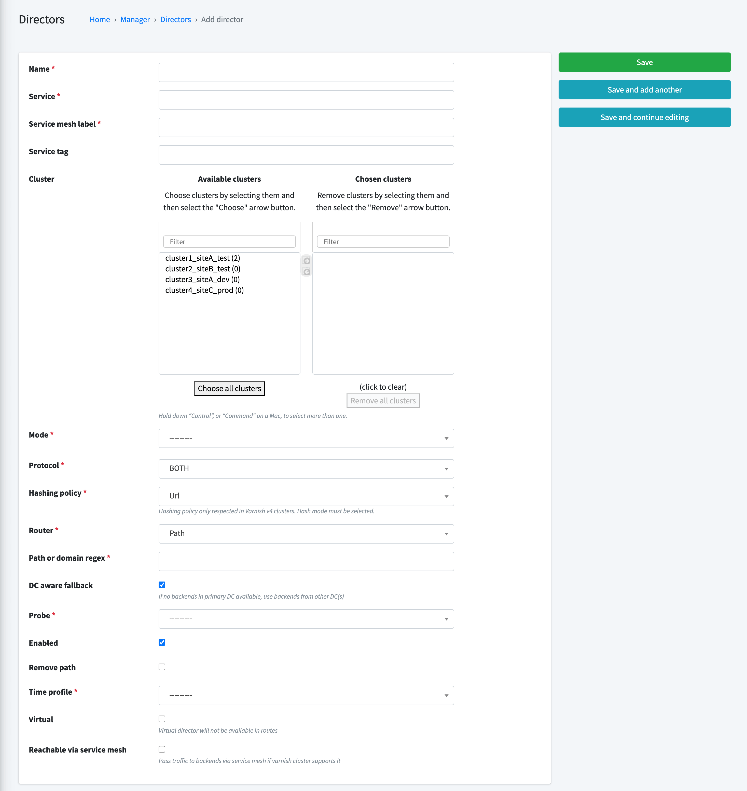
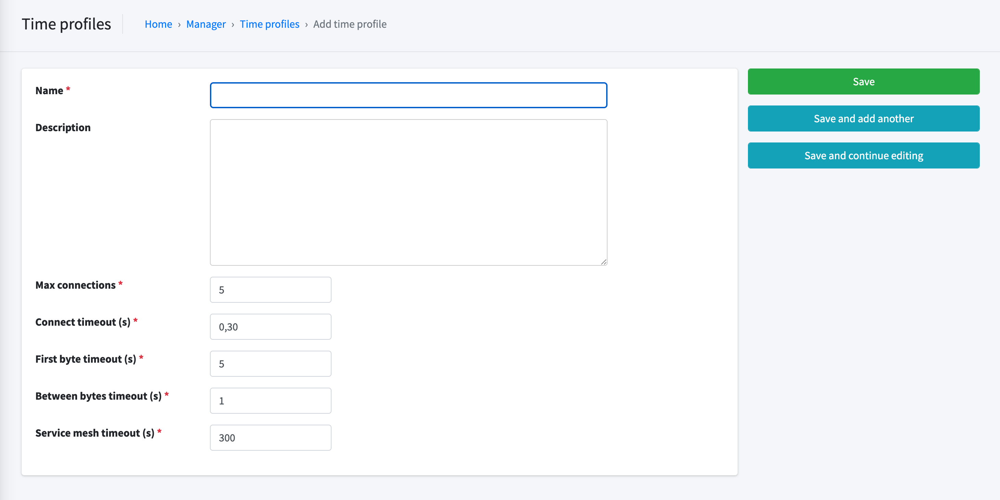
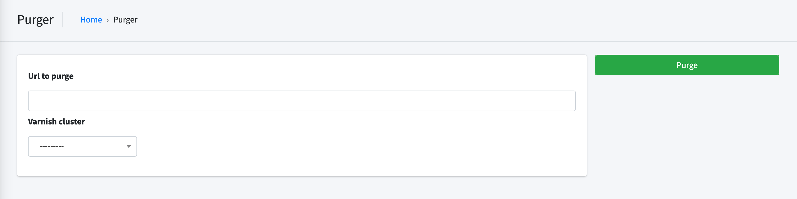

VaaS GUI
========
This article will demonstrate the features of VaaS GUI. Scren shots below come from [VaaS in Vagrant](../quick-start/vagrant.md).

VaaS comprizes several Django apps, of which two are available via a web browser: *Cluster* and *Manager*.

In the **Cluster** app you can:

* Define and edit Varnish Servers
* Group Varnish servers into Clusters
* Define and edit data centres
* Define and edit VCL templates
* Overwrite default VCL template blocks
* Assign VCL templates to Varnish Servers

In the **Manager** app you can:

* Define and edit Backends
* Define and edit Directors
* Define and edit Probes
* Associate Directors with Varnish Server clusters

Cluster app
===========

## [Cluster] Varnish servers
To define a new Varnish server, click on *Cluster -> Varnish servers -> Add varnish server* and fill in the form:

* **Ip:** IP address of the new Varnish server
* **Hostname:** hostname or a descriptive name 
* **Cluster weight:** unused
* **Port:** Varnish API port number
* **Secret:** contents of /etc/varnish/secret file
* **Enabled:** enable / disable the server (only tells VaaS to update VCLs; does not start / stop Varnish service)
* **Dc:** data centre in which the server is located (used to determine active and fallback directors)
* **Template:** VCL template to be used by the server
* **Cluster:** name of the cluster the server belongs to

## [Cluster] Vcl templates
To define a new Varnish VCL, click on *Cluster -> Vcl templates -> Add vcl template* and fill in the form:

* **Name:** name of the new VCL
* **Content:** VCL content (see [VCL template documentation](../documentation/vcl.md))
* **Version:** VCL version

## [Cluster] Vcl template blocks
To define a new Vcl template block, click on *Cluster -> Vcl template blocks -> Add template block* and fill in the form:

* **Tag:** where in the VCL is the template block to be inserted
* **Template:** which template should use the template block
* **Content:** VCL template content (see [VCL template documentation](../documentation/vcl.md))

## [Cluster] Dcs

VaaS supports multiple DCs. A DC in the application consists of a DC name and a DC symbol.

## [Cluster] Logical clusters

In VaaS, Varnish servers can be grouped into clusters. Each cluster can use a different set of directors.

Manager app
===========

## [Manager] Directors

To define a new director, click on *Manager -> Directors -> Add director* and fill in the form:

* **Name:** specify a name of the new director
* **Cluster:** select cluster(s) in which the director should be used
* **Mode:** specify balancing algorithm
* **Hasing policy:** specify hashing policy
* **Router:** specify how to route traffic to the director (may be overwritten in VCL template)
* **Path or domain regex:** url or domain regex used to route the traffic to the director
* **DC aware fallback:** route traffic to primary DC first; use other DCs as fallback (see [using VaaS across multiple DCs](../documentation/dc.md))
* **Probe:** specify healthcheck to use for the director's backend
* **Enabled:** enable or disable the director
* **Remove path:** remove the part of url defined in *Path or domain regex* before passing request to backend
* **Time profile:** default advanced timeout setting for each backend in director

## [Manager] Backends
To define a new backend, click on *Manager -> Backends -> Add backend* and fill in the form:

* **Address:** IP address of the backend host
* **Port:** IP port of the backend host
* **Director:** name of the director in which the backend should appear
* **Dc:** name of the DC in which the backend is located
* **Weight:** value required by some directors

## [Manager] Probes
To define a new probe, click on *Manager -> Probes -> Add probe* and fill in the form:

* **Name:** name of the probe
* **Url:** url to test
* **Expected response:** expected http response code

## [Manager] Time Profiles
To define a new time profile, click on *Manager -> Time Profiles -> Add time profile* and fill in the form:

* **Name:** name of the time profile
* **Description** description of time profile
* **Max connections:** max connections per backend
* **Connect timeouts:** limits how long we wait for a TCP connection to the backend to come up
* **First byte timeouts:** limits how long the processing time of the backend may be. The first byte of the response must come down the TCP connection within this timeout
* **Between bytes timeouts:** limits how long we will wait between for two subsequent successful reads on the backend connection

## [Manager] Purger
To purge object from varnishes from a given cluster, click on *Manager -> Purger -> and fill in the form:

* **Url to purge:** url of object to purge eg. http://example.com/contact
* **Varnish Cluster:** select cluster to purge
